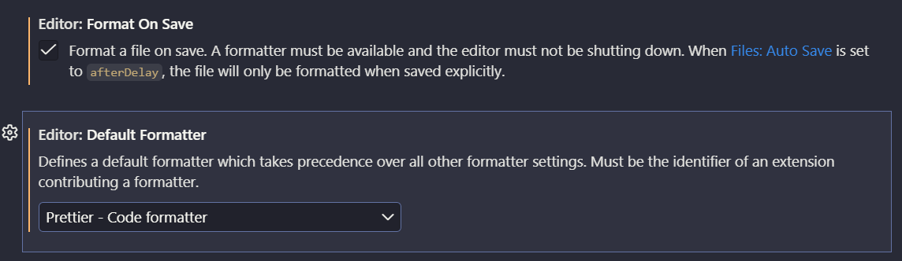

# Arrancando a desarrollar

## Creamos un proyecto base de Vite

```sh
npm create vite@latest ./ -- --template vanilla
```

## Instalar dependencias

```sh
npm i # npm install
```

## Arrancar el servidor de desarrollo

```sh
npm run dev
```

## Detener el servidor de desarrollo

Ctrl + C

# Configurar el editorconfig

Sirve para generar reglas base sobre el editor y el proyecto

<https://editorconfig.org/>

## Instalamos la extensión

- EditorConfig.EditorConfig

## Crear el archivo .editorconfig

```init
# EditorConfig is awesome: https://editorconfig.org
root = true

[*]
charset = utf-8
end_of_line = lf
indent_style = space
indent_size = 2
insert_final_newline = true
trim_trailing_whitespace = true

[*.md]
trim_trailing_whitespace = false
```

# Agregando al proyecto prettier

Formatear nuestro código fuente, mejorando y estandarizando para todo el equipo.

<https://prettier.io/>

## Instalamos la extensión

- esbenp.prettier-vscode

## Crear un archivo de config .prettierrc.json

```json
{
  "printWidth": 100,
  "tabWidth": 2,
  "useTabs": false,
  "semi": true,
  "singleQuote": true,
  "trailingComma": "es5",
  "bracketSpacing": true,
  "arrowParens": "avoid",
  "endOfLine": "lf"
}
```

## Terminar de configurar prettier

En Visual Studio Code tengo que ir a la Ruedita que está ubicada abajo a la izquierda.


